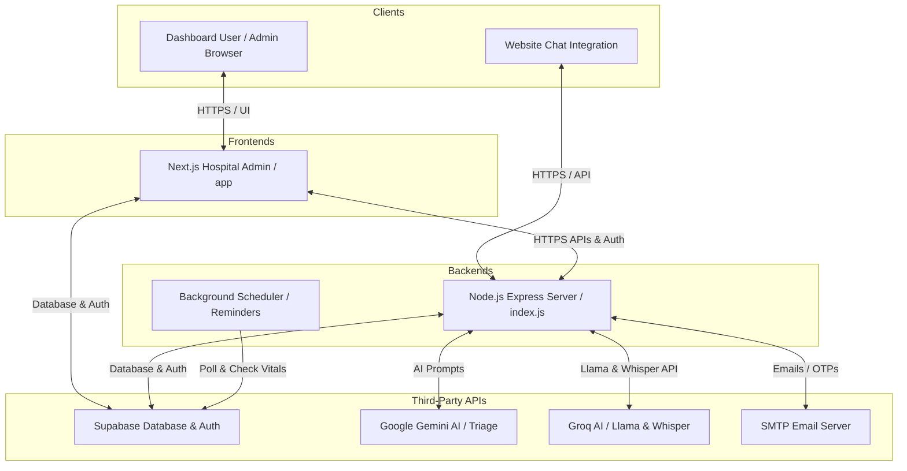

# Cura Healthcare Deployment & Setup Guide

This guide provides step-by-step instructions for deploying the **Cura Healthcare** platform, which consists of two main components:
1. **Next.js Admin & Patient Dashboard** (`hospital-admin`) — Serverless frontend/admin app.
2. **Node.js Express Backend & Web Chat API** (`whatsapp-bot` root) — Persistent background scheduler and API server.

---

## 🏗️ Architecture Overview



### Deployment Strategy
- **`hospital-admin` (Next.js)**: Ideal for serverless platforms like **Vercel** (highly recommended) or Netlify.
- **`whatsapp-bot` (Express / Web Chat Backend)**: Requires a **persistent Node.js container or server** because it runs background schedules (`setInterval` for reminders) that cannot execute on serverless functions. Recommended platforms are **Railway**, **Render**, **DigitalOcean Droplet**, or any **Docker-compatible VPS**.

---

## 🗄️ Step 1: Database Setup (Supabase)

The platform relies on Supabase for database storage, patient authentication, and doctor/hospital configurations. 

1. Go to [Supabase Console](https://supabase.com/) and create a new project.
2. In the **SQL Editor**, run the following schema scripts to create all the required tables:

```sql
-- 1. HOSPITALS TABLE
CREATE TABLE hospitals (
    id UUID PRIMARY KEY DEFAULT gen_random_uuid(),
    name TEXT NOT NULL,
    address TEXT,
    created_at TIMESTAMP WITH TIME ZONE DEFAULT timezone('utc'::text, now()) NOT NULL
);

-- 2. DOCTORS TABLE
CREATE TABLE doctors (
    id UUID PRIMARY KEY DEFAULT gen_random_uuid(),
    name TEXT NOT NULL,
    department TEXT NOT NULL,
    phone TEXT,
    is_available BOOLEAN DEFAULT true NOT NULL,
    hospital_id UUID REFERENCES hospitals(id) ON DELETE CASCADE,
    created_at TIMESTAMP WITH TIME ZONE DEFAULT timezone('utc'::text, now()) NOT NULL
);

-- 3. APPOINTMENTS TABLE
CREATE TABLE appointments (
    id UUID PRIMARY KEY DEFAULT gen_random_uuid(),
    name TEXT NOT NULL,
    phone TEXT NOT NULL,
    date DATE NOT NULL,
    slot TEXT NOT NULL,
    status TEXT NOT NULL DEFAULT 'booked', -- 'booked', 'pending', 'cancelled', 'completed'
    reason TEXT,
    consultation_type TEXT DEFAULT 'in-person', -- 'in-person', 'call'
    meet_link TEXT,
    ai_notes TEXT,
    hospital_id UUID REFERENCES hospitals(id) ON DELETE CASCADE,
    doctor_id UUID REFERENCES doctors(id) ON DELETE SET NULL,
    created_at TIMESTAMP WITH TIME ZONE DEFAULT timezone('utc'::text, now()) NOT NULL
);

-- 4. PRESCRIPTIONS TABLE
CREATE TABLE prescriptions (
    id UUID PRIMARY KEY DEFAULT gen_random_uuid(),
    appointment_id UUID REFERENCES appointments(id) ON DELETE SET NULL,
    doctor_id UUID REFERENCES doctors(id) ON DELETE SET NULL,
    hospital_id UUID REFERENCES hospitals(id) ON DELETE CASCADE,
    patient_phone TEXT NOT NULL,
    medicines JSONB DEFAULT '[]'::jsonb,
    notes TEXT,
    pdf_url TEXT,
    created_at TIMESTAMP WITH TIME ZONE DEFAULT timezone('utc'::text, now()) NOT NULL
);

-- 5. WEB PATIENTS (For Website User Authentication Profiles)
CREATE TABLE web_patients (
    auth_user_id UUID PRIMARY KEY, -- Matches auth.users.id
    email TEXT,
    phone TEXT,
    name TEXT,
    height NUMERIC,
    weight NUMERIC,
    blood_group TEXT,
    bmi NUMERIC,
    emergency_contact TEXT,
    last_seen TIMESTAMP WITH TIME ZONE DEFAULT timezone('utc'::text, now()) NOT NULL
);
```

> [!NOTE]
> Ensure you enable **Row Level Security (RLS)** in Supabase and write appropriate policies, or temporarily disable RLS during initial setup and testing. For administrative authentication, make sure you configure your email/phone provider settings in Supabase Auth.

---

## 💻 Step 2: Deploy Next.js Frontend (`hospital-admin`)

Deploying the frontend Next.js app to **Vercel** takes under 5 minutes:

### 1. Push to Git
Commit your changes and push the codebase to GitHub, GitLab, or Bitbucket.

### 2. Import into Vercel
1. Log in to [Vercel](https://vercel.com).
2. Click **Add New** > **Project** and select your repository.
3. Set the **Root Directory** to `whatsapp-bot/hospital-admin`.
4. Leave **Build Command** as `next build` and **Output Directory** as standard.

### 3. Configure Environment Variables
Add the following key-value pairs in the **Environment Variables** section of the Vercel project:

| Variable Name | Description / Suggested Value |
|---|---|
| `NEXT_PUBLIC_SUPABASE_URL` | Your Supabase Project URL |
| `NEXT_PUBLIC_SUPABASE_ANON_KEY` | Your Supabase Anon Key (Client safe) |
| `SUPABASE_URL` | Your Supabase Project URL (Server side) |
| `SUPABASE_KEY` | Your Supabase Anon Key (Server side) |
| `SUPABASE_SERVICE_KEY` | Your Supabase **Service Role** key (Required for password bypass/admin actions) |
| `GEMINI_API_KEY` | Google Gemini API Key |
| `GROQ_API_KEY` | Groq Developer API Key |
| `APP_URL` | The production URL of this deployed frontend (e.g. `https://yourdomain.vercel.app`) |
| `NEXT_PUBLIC_OTP_RECIPIENT` | Fallback admin email to test OTPs (e.g. `yourname@gmail.com`) |
| `SMTP_HOST` | E.g. `smtp.gmail.com` |
| `SMTP_PORT` | E.g. `587` |
| `SMTP_SECURE` | E.g. `false` (set `true` for Port 465 SSL) |
| `SMTP_USER` | E.g. `your-gmail@gmail.com` |
| `SMTP_PASS` | E.g. `your-app-specific-password` (Must be Gmail App Password, not normal password) |

Click **Deploy**!

---

## 🤖 Step 3: Deploy Express Backend (`whatsapp-bot` root)

The Express backend must be deployed on a server that keeps running 24/7. It acts as the chat API endpoint `/api/web-chat` for your website widget, and manages background tasks.

### Recommended Platform: **Railway** or **Render** with a Dockerfile
Deploying via the preconfigured `Dockerfile` makes it extremely simple.

#### 1. Configure the Dockerfile
We have set up a lightweight Alpine-based Docker container that starts the API server in seconds:

```dockerfile
# Use a lightweight Node.js Alpine image for minimal size and high performance
FROM node:18-alpine

# Set working directory inside container
WORKDIR /usr/src/app

# Copy package metadata first to optimize Docker build caching
COPY package*.json ./

# Install only production dependencies
RUN npm ci --only=production

# Copy the rest of the application files
COPY . .

# Expose the default backend port (4000)
EXPOSE 4000

# Start the application
CMD [ "node", "index.js" ]
```

> [!TIP]
> Since we removed WhatsApp and Puppeteer headless browser engines, **no persistent storage volume mounts are needed!** The container is fully stateless and builds in seconds.

---

### Step 4: Configure Backend Environment Variables

Provide the following environment variables to your hosted backend:

| Variable Name | Required? | Description / Recommended Value |
|---|---|---|
| `PORT` | Yes | Port to listen on (e.g. `4000` or `8080`) |
| `FRONTEND_URL` | Yes | The URL of your Next.js frontend (e.g. `https://your-domain.vercel.app`) to bypass CORS |
| `SUPABASE_URL` | Yes | Supabase URL |
| `SUPABASE_KEY` | Yes | Supabase Anon Key |
| `SUPABASE_SERVICE_KEY` | Yes | Supabase Service Role Key |
| `GEMINI_API_KEY` | Yes | Google Gemini API Key (fallback AI triage) |
| `GROQ_API_KEY` | Yes | Groq API Key (primary LLaMA 3.3 triage & Whisper audio transcriptions) |
| `SMTP_HOST` | Yes | E.g. `smtp.gmail.com` |
| `SMTP_PORT` | Yes | E.g. `587` |
| `SMTP_SECURE` | Yes | E.g. `false` |
| `SMTP_USER` | Yes | E.g. `your-email@gmail.com` |
| `SMTP_PASS` | Yes | Gmail app-specific password |

---

## ⚡ Deployment Checklists & Troubleshooting

### 1. React Web App fails to load patients history
- Check that `APP_URL` on your Next.js app matches the actual host domain.
- Check that your Next.js code is calling your Express backend API. By default, ensure there's a `.env.local` or environment config instructing the frontend where the API is hosted.

### 2. Emails not sending
- Verify that `SMTP_PASS` is a 16-character Gmail **App Password** (generated under Google Account settings > Security > 2-step Verification > App Passwords) rather than your standard Gmail password.
- Verify `SMTP_SECURE` is set to `false` for port `587` (TLS) or `true` for port `465` (SSL).
